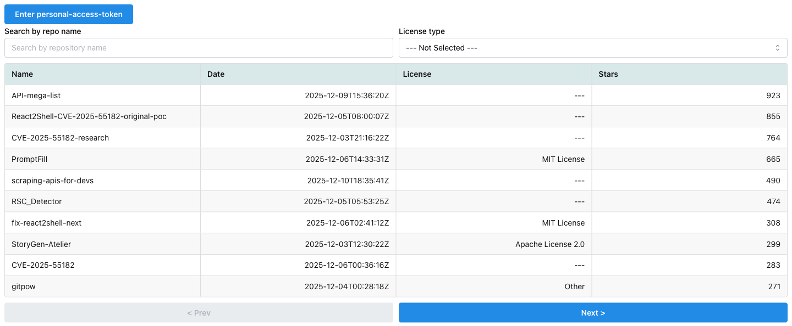
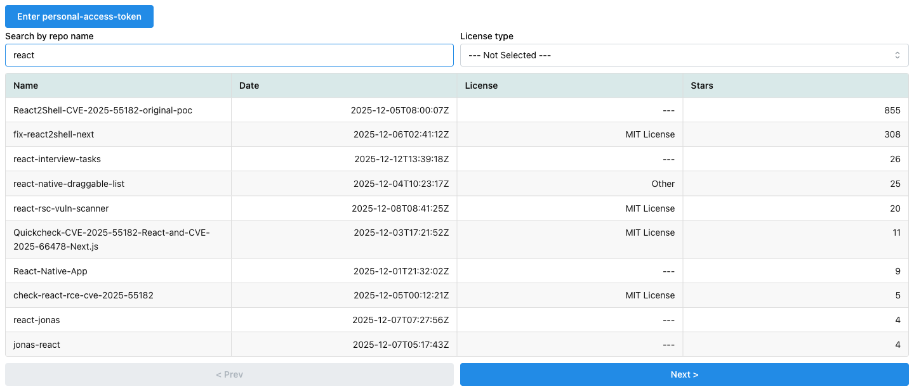
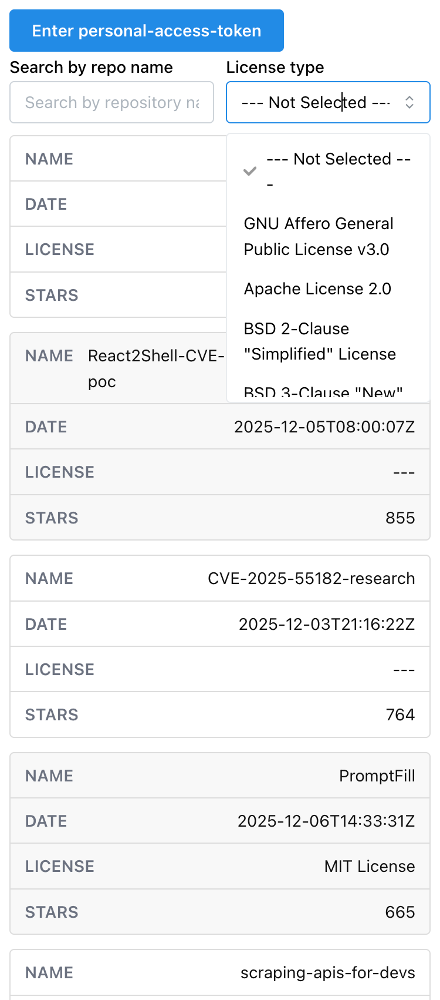

[](https://hits.seeyoufarm.com)

# NX monorepo boilerplate with React + Vite + TypeScript + Mantine

## Getting Started

### Prerequisites

```sh
# Install NX
npm install -g nx

# Init project
npm run init-project
```

### Development

1. Read [how to create GitHub access token](https://help.github.com/en/github/authenticating-to-github/creating-a-personal-access-token-for-the-command-line)
2. Add `.env` into `./`
   ```bash
   cp ./env.example ./.env
   ```
3. Add `.env.local` into `./packages/graphql/.env.local`
   ```bash
   cp ./packages/graphql/env.example ./packages/graphql/.env.local
   ```
   and add your GitHub token (see step 1)
4. Add `.env.local` to `./apps/main/.env.local`
   ```bash
   cp ./apps/main/env.example ./apps/main/.env.local
   ```
   and add your GitHub token (see step 1)
5. _[Optional step]_ Generate code from GraphQL schema
   ```sh
   npm run codegen:graphql
   ```
6. Start the app
   ```sh
   npm run dev
   ```
   and open the page http://localhost:3000/

### Examples

- [GitHub repository list](https://dipiash.github.io/nx-vite-react-ts-mantine-boilerplate/)

### App screenshots

#### Desktop version





#### Mobile version



### Features

- [Nx 16](https://nx.dev)
- [React 18](https://reactjs.org)
- [Mantine 7](https://mantine.dev/)
- [Storybook 7](https://storybook.js.org/)
- [TypeScript](https://www.typescriptlang.org/)
- [Vite 5](https://vitejs.dev/)
- [Vitest](https://vitest.dev/)
- [React Testing Library](https://testing-library.com/docs/react-testing-library/intro)
- [Cypress](https://www.cypress.io)
- [ESLint](https://eslint.org/)
- HMR (Hot Module Replacement)

## License
This code is licensed under the MIT License. 
You can find the license file [here](/LICENSE).
